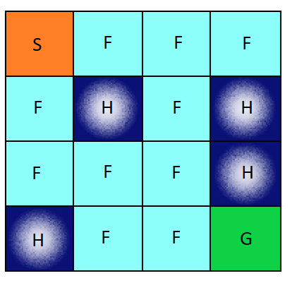

# FrozenLake with Deep Q Learning Algorithm

**EDIT:** **You may have trouble opening the ```.ipynb``` file, try the ```.py``` file instead they contain the same code.**


In this repository I try to implement **Deep Q Learning algorithm** in the **FrozenLake** environment.

## Deep Q Learning 

In this algorithm we use a Q table. Values in this table are based on exploration and exploitation strategies. The agent takes an action based on the values on our Q table and moves towards the goal. Once agent changes from one state to another the calculation is done with the following equation:
```
 Q(s,a) => Q(s,a) + lr [R(s,a) + gamma * max Q(s',a') - Q(s,a)]
```
Along the way the agent gets a reward or a penalty. More in depth knowledge about this algorith can be found [here](https://blog.valohai.com/reinforcement-learning-tutorial-part-1-q-learning).

## FrozenLake Game

Imagine, you are standing on a frozen lake. The lake is not all frozen, there are some parts where the ice is very thin. You goal is to go from place S to G without falling into the holes.



Here,
* S --> Source
* G --> Goal
* F --> Solid Ice (Agent can stand)
* H --> Hole (Agent falls through)

More about **FrozenLake** environment can be found [here](https://analyticsindiamag.com/openai-gym-frozen-lake-beginners-guide-reinforcement-learning/).

## Built With
* Python3
* Keras (running tensorflow in the backend)
* gym -> details [here](http://gym.openai.com/docs/)

## Libraries Used
* random
* numpy

## How it Works

Here my goal is to make the agent perform better with time as it learns from exploring the environment. The higher values on the Qtable is going to make the agent perform better and help to reach the goal with better rewards. 


